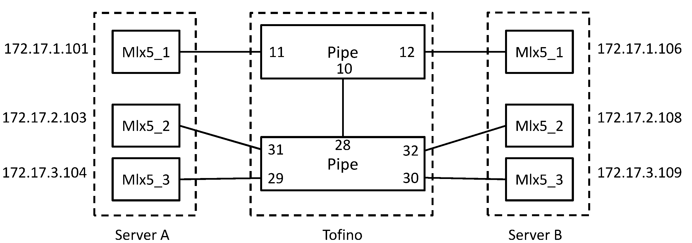

# Hawkeye

This repository contains the source codes of the prototype for our paper: `HAWKEYE: Diagnosing RDMA Network Performance Anomalies
with PFC Provenance` in SIGCOMM 2025.

It contains the NS-3 simulator in `./simulation/`; the detection agent monitoring RTT in `./detection-agent/`; the Tofino switch codes including p4 files for the data plane in `./switch/`, and C files for the controller in `./ctrl/`.

## NS-3 simulator for Hawkeye

Our simulator is based on the [RDMA simulator for HPCC](https://github.com/alibaba-edu/High-Precision-Congestion-Control). It is based on NS-3 version 3.17.


### Build
```
cd simulation
sudo chmod +x waf
./waf configure
```

Please note if gcc version > 5, compilation will fail due to some ns3 code style.  If this what you encounter, please use:

`CC='gcc-5' CXX='g++-5' ./waf configure`

### Experiment setup
Please see `simulation/mix/config.txt` for example. 

We provide setup examples for diagnosing two types of NPA: LoRDMA attack and PFC deadlock. You can find them in the simulation/mix directory for LoRDMA attack and the simulation/mix_deadlock directory for PFC deadlock. 

You can copy the `simulation/mix` directory and modify the configuration files to run the simulation you need.


### Run

```./waf --run 'scratch/third mix/config.txt'```

It will run the example of LoRDMA attack diagnosis. 

The telemetry data reported by the switches will be output in `simulation/mix/data`. In this directory, run 
```python3 graph.py``` 
to construct the provenance graph. The nodes, edges and edge weights of the graph will be output in `telemetry.json`.

You can check the code `simulation/scratch/third.cc` to see the main logic of the simulations. 

To run the example of PFC deadlock diagnosis:

```./waf --run 'scratch/third_deadlock mix_deadlock/config.txt'```

In the code `simulation/scratch/third_deadlock.cc`, we have modified the routing policies to construct PFC deadlock.

## Detection agent


The detection agent monitors flow RTT and send polling packet to network, built based on DOCA PCC.

Please refer to `detection-agent/README.md` for specific building and runnning instructions.

## Tofino prototype

The data plane codes in P4 are at `./switch/`, and the controller codes in C  are at `./ctrl`.

The data plane logs the PFC-aware telemetry and causality, forwards the polling packet, and notifies the CPU to poll telemetry.

The controller sets up the lossless network, installs forwarding table entries, and polls the telemetry once receving new polling packet from the switch.

### Emulated topology

We set an example topology which emultates 2 logical switches within one Tofino. 
We also set a special 2-D L3 forwarding table to emulate such forwarding behaviors. 
You can adjust the forwarding table or the forwarding table entries to change the topology as you like.



We give an example forwarding entry list in `ctrl/switch_config.h`, and an entry genarator script `ctrl/entry_list_gen.py`.

### Compile and Run


Load `Kpkt` driver

```bash
$SDE_INSTALL/bin/bf_kdrv_mod_unload
$SDE_INSTALL/bin/bf_kpktmod_load $SDE_INSTALL
```

Compile the code

```bash
make switch
./contrl
```

Filter PFC to the P4 pipelines.

In another window, configure the `rxconfig` in MAC, so that MAC can transmit PFC frames to the P4 pipeline.

```bash
$SDE/run_bfshell.sh
# config rxconfig
ucli
access
wr dev0 macs[PORT_NUM] comira_regs mcmac0 rxconfig 0x0030
```
